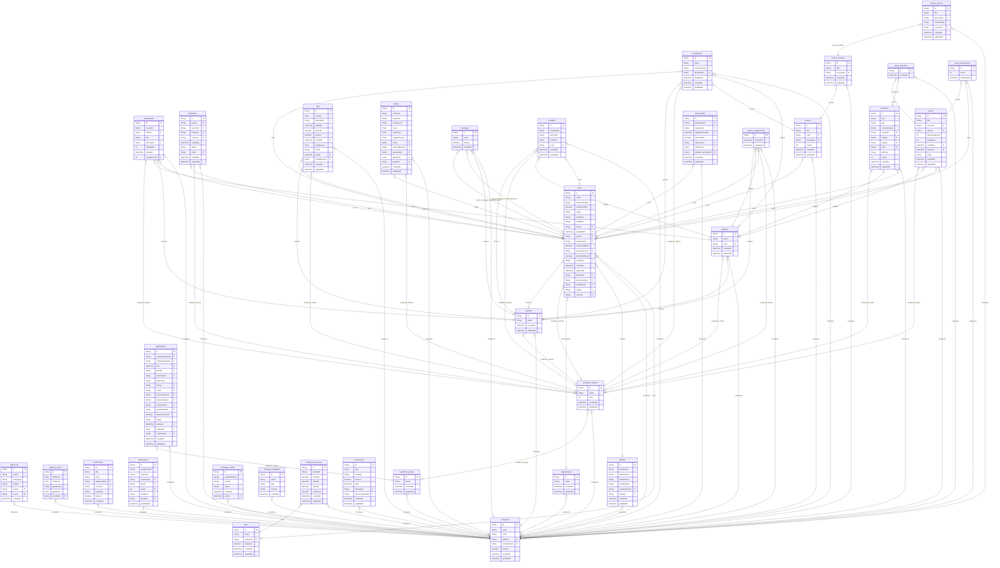

```mermaid
erDiagram

  "applications" {
    String id "🗝️"
    String studentFirstName "❓"
    String studentLastName "❓"
    DateTime dob "❓"
    String gender "❓"
    String fatherName "❓"
    String fatherCnic "❓"
    String phone "❓"
    String email "❓"
    String previousSchool "❓"
    String desiredClassId "❓"
    String motherName "❓"
    String guardianName "❓"
    Decimal discountAmount 
    String status 
    DateTime testDate "❓"
    Float testMarks "❓"
    String reviewNotes "❓"
    DateTime createdAt 
    DateTime updatedAt 
    }
  

  "assignments" {
    String id "🗝️"
    String courseId 
    String classId "❓"
    String title 
    String description "❓"
    Int maxMarks 
    DateTime dueDate 
    Int weightPercent "❓"
    }
  

  "attendance" {
    String id "🗝️"
    String userId "❓"
    String sectionId "❓"
    String subjectId "❓"
    String courseId "❓"
    DateTime classDate 
    String status 
    String notes "❓"
    DateTime createdAt 
    DateTime updatedAt 
    }
  

  "audit_logs" {
    String id "🗝️"
    String action 
    String entityType 
    String entityId 
    String reason "❓"
    String userId "❓"
    DateTime createdAt 
    }
  

  "courses" {
    String id "🗝️"
    String title 
    String code "❓"
    String description "❓"
    Int credits 
    DateTime createdAt 
    DateTime updatedAt 
    }
  

  "enrollments" {
    String id "🗝️"
    String status 
    String academicYear "❓"
    String dropReason "❓"
    DateTime droppedAt "❓"
    DateTime createdAt 
    DateTime updatedAt 
    }
  

  "fees" {
    String id "🗝️"
    Float amount 
    String description "❓"
    DateTime dueDate 
    Decimal discount 
    Decimal lateFee 
    DateTime holdUntil "❓"
    Float paidAmount 
    String status 
    DateTime paidAt "❓"
    String refundReason "❓"
    DateTime createdAt 
    DateTime updatedAt 
    }
  

  "grading_criteria" {
    String id "🗝️"
    Float minScore 
    Float maxScore 
    String gradeLetter 
    Float gpaPoints 
    String description "❓"
    }
  

  "marks" {
    String id "🗝️"
    String sectionId 
    String subjectId 
    String component 
    Float score 
    Float maxScore 
    Float weightPercent 
    String notes "❓"
    String overrideReason "❓"
    String gradeLetter "❓"
    Float gpaPoints "❓"
    String graderId "❓"
    DateTime createdAt 
    DateTime updatedAt 
    }
  

  "messages" {
    String id "🗝️"
    String body 
    Boolean isRead 
    DateTime createdAt 
    }
  

  "notifications" {
    String id "🗝️"
    String title 
    String body 
    String audienceRole "❓"
    String courseId "❓"
    String senderId 
    Boolean isRead 
    DateTime createdAt 
    }
  

  "submissions" {
    String id "🗝️"
    String assignmentId 
    String studentId 
    String textContent "❓"
    String fileUrl "❓"
    Int grade "❓"
    String feedback "❓"
    String graderId "❓"
    DateTime submittedAt 
    }
  

  "timetable" {
    String id "🗝️"
    String dayOfWeek 
    String startTime 
    String endTime 
    String room "❓"
    DateTime createdAt 
    DateTime updatedAt 
    }
  

  "users" {
    String id "🗝️"
    String email 
    String passwordHash 
    Boolean isSuperAdmin 
    String status 
    String firstName 
    String lastName 
    String phone "❓"
    DateTime dateOfBirth "❓"
    String gender "❓"
    String profilePicture "❓"
    Boolean isTeachingStaff 
    String previousSchool "❓"
    Decimal discountAmount 
    String metadata "❓"
    DateTime createdAt 
    DateTime updatedAt 
    String grNumber "❓"
    String bFormNumber "❓"
    String bloodGroup "❓"
    String religion "❓"
    String domicile "❓"
    }
  

  "academic_classes" {
    String id "🗝️"
    String name 
    Int level 
    DateTime createdAt 
    DateTime updatedAt 
    }
  

  "academic_groups" {
    String id "🗝️"
    String name 
    DateTime createdAt 
    DateTime updatedAt 
    }
  

  "campuses" {
    String id "🗝️"
    String name 
    String code 
    String address "❓"
    String contactPhone "❓"
    Boolean isActive 
    DateTime createdAt 
    DateTime updatedAt 
    }
  

  "course_lessons" {
    String id "🗝️"
    String title 
    String description "❓"
    String contentType 
    String contentUrl "❓"
    DateTime createdAt 
    DateTime updatedAt 
    }
  

  "course_modules" {
    String id "🗝️"
    String title 
    String description "❓"
    DateTime createdAt 
    DateTime updatedAt 
    }
  

  "departments" {
    String id "🗝️"
    String name 
    DateTime createdAt 
    DateTime updatedAt 
    }
  

  "exam_questions" {
    String id "🗝️"
    DateTime createdAt 
    }
  

  "exam_submissions" {
    String id "🗝️"
    Int score 
    DateTime submittedAt 
    }
  

  "exams" {
    String id "🗝️"
    String title 
    String courseId "❓"
    String classId "❓"
    Int durationMinutes 
    Int totalMarks 
    DateTime startTime "❓"
    DateTime endTime "❓"
    String status 
    DateTime createdAt 
    DateTime updatedAt 
    }
  

  "families" {
    String id "🗝️"
    String familyCode 
    String fatherName 
    String fatherPhone 
    String motherName "❓"
    String guardianName "❓"
    String address "❓"
    DateTime createdAt 
    DateTime updatedAt 
    }
  

  "message_outbox" {
    String id "🗝️"
    String recipientPhone 
    String content 
    String status 
    DateTime createdAt 
    DateTime sentAt "❓"
    }
  

  "message_templates" {
    String id "🗝️"
    String name 
    String type 
    String content 
    DateTime createdAt 
    }
  

  "module_permissions" {
    String id "🗝️"
    String moduleId 
    Boolean canView 
    Boolean canAdd 
    Boolean canEdit 
    Boolean canDelete 
    DateTime createdAt 
    DateTime updatedAt 
    }
  

  "questions" {
    String id "🗝️"
    String text 
    String type 
    String correctAnswer 
    String courseId "❓"
    String classId "❓"
    String chapter "❓"
    String topic "❓"
    String difficulty 
    Int marks 
    DateTime createdAt 
    DateTime updatedAt 
    }
  

  "roles" {
    String id "🗝️"
    String name 
    String campusId "❓"
    Boolean isSystem 
    DateTime createdAt 
    DateTime updatedAt 
    }
  

  "sections" {
    String id "🗝️"
    String name 
    DateTime createdAt 
    DateTime updatedAt 
    }
  

  "staff_profiles" {
    String id "🗝️"
    String qualifications "❓"
    String experience "❓"
    DateTime appointmentDate "❓"
    Decimal basicSalary 
    String allowances "❓"
    String deductions "❓"
    String bankAccountDetails "❓"
    DateTime createdAt 
    DateTime updatedAt 
    }
  

  "subjects" {
    String id "🗝️"
    String name 
    String code "❓"
    DateTime createdAt 
    DateTime updatedAt 
    }
  

  "teacher_assignments" {
    String id "🗝️"
    DateTime createdAt 
    DateTime updatedAt 
    }
  

  "transactions" {
    String id "🗝️"
    String type 
    String category 
    Decimal amount 
    DateTime date 
    String description "❓"
    String referenceNumber "❓"
    DateTime createdAt 
    DateTime updatedAt 
    }
  
    "applications" }o--|o "campuses" : "campuses"
    "applications" }o--|o "academic_groups" : "academic_groups"
    "assignments" }o--|o "campuses" : "campuses"
    "assignments" }o--|o "users" : "users"
    "assignments" }o--|o "sections" : "sections"
    "assignments" }o--|o "subjects" : "subjects"
    "assignments" }o--|o "academic_classes" : "academic_classes"
    "attendance" }o--|o "campuses" : "campuses"
    "attendance" }o--|o "academic_classes" : "academic_classes"
    "attendance" }o--|o "users" : "users"
    "audit_logs" }o--|o "campuses" : "campuses"
    "courses" }o--|o "campuses" : "campuses"
    "courses" }o--|| "users" : "users"
    "enrollments" }o--|o "campuses" : "campuses"
    "enrollments" }o--|o "subjects" : "subjects"
    "enrollments" }o--|o "courses" : "courses"
    "enrollments" }o--|o "academic_classes" : "academic_classes"
    "enrollments" }o--|o "sections" : "sections"
    "enrollments" }o--|| "users" : "users"
    "fees" }o--|o "campuses" : "campuses"
    "fees" }o--|o "academic_classes" : "academic_classes"
    "fees" }o--|o "sections" : "sections"
    "fees" }o--|| "users" : "users"
    "grading_criteria" }o--|o "campuses" : "campuses"
    "marks" }o--|o "campuses" : "campuses"
    "marks" }o--|o "academic_classes" : "academic_classes"
    "marks" }o--|| "users" : "users"
    "messages" }o--|o "campuses" : "campuses"
    "messages" }o--|o "sections" : "sections"
    "messages" }o--|o "users" : "users_messages_receiverIdTousers"
    "messages" }o--|| "users" : "users_messages_senderIdTousers"
    "notifications" }o--|o "campuses" : "campuses"
    "submissions" }o--|o "campuses" : "campuses"
    "timetable" }o--|o "campuses" : "campuses"
    "timetable" }o--|o "users" : "users"
    "timetable" }o--|| "subjects" : "subjects"
    "timetable" }o--|o "academic_classes" : "academic_classes"
    "timetable" }o--|| "sections" : "sections"
    "users" }o--|o "roles" : "roles"
    "users" }o--|o "campuses" : "campuses"
    "users" }o--|o "families" : "families"
    "users" }o--|o "departments" : "departments"
    "users" }o--|o "academic_classes" : "academic_classes"
    "users" }o--|o "sections" : "sections"
    "academic_classes" }o--|o "campuses" : "campuses"
    "academic_classes" }o--|o "academic_groups" : "academic_groups"
    "academic_groups" }o--|| "campuses" : "campuses"
    "course_lessons" }o--|o "campuses" : "campuses"
    "course_lessons" }o--|| "course_modules" : "course_modules"
    "course_modules" }o--|o "campuses" : "campuses"
    "course_modules" }o--|| "courses" : "courses"
    "departments" }o--|| "campuses" : "campuses"
    "exam_questions" }o--|o "campuses" : "campuses"
    "exam_questions" }o--|| "questions" : "questions"
    "exam_questions" }o--|| "exams" : "exams"
    "exam_submissions" }o--|o "campuses" : "campuses"
    "exam_submissions" }o--|| "users" : "users"
    "exam_submissions" }o--|| "exams" : "exams"
    "exams" }o--|o "campuses" : "campuses"
    "exams" }o--|o "users" : "users"
    "exams" }o--|o "subjects" : "subjects"
    "exams" }o--|o "academic_classes" : "academic_classes"
    "families" }o--|o "campuses" : "campuses"
    "message_outbox" }o--|o "campuses" : "campuses"
    "message_templates" }o--|o "campuses" : "campuses"
    "module_permissions" }o--|o "campuses" : "campuses"
    "module_permissions" }o--|| "roles" : "roles"
    "questions" }o--|o "campuses" : "campuses"
    "questions" }o--|o "users" : "users"
    "questions" }o--|o "subjects" : "subjects"
    "questions" }o--|o "academic_classes" : "academic_classes"
    "sections" }o--|o "campuses" : "campuses"
    "sections" }o--|| "academic_classes" : "academic_classes"
    "staff_profiles" }o--|o "campuses" : "campuses"
    "staff_profiles" |o--|| "users" : "users"
    "subjects" }o--|o "campuses" : "campuses"
    "subjects" }o--|o "sections" : "sections"
    "subjects" }o--|| "academic_classes" : "academic_classes"
    "teacher_assignments" }o--|o "campuses" : "campuses"
    "teacher_assignments" }o--|o "academic_classes" : "academic_classes"
    "teacher_assignments" }o--|| "users" : "users"
    "teacher_assignments" }o--|| "subjects" : "subjects"
    "teacher_assignments" }o--|| "sections" : "sections"
    "transactions" }o--|o "campuses" : "campuses"
```
