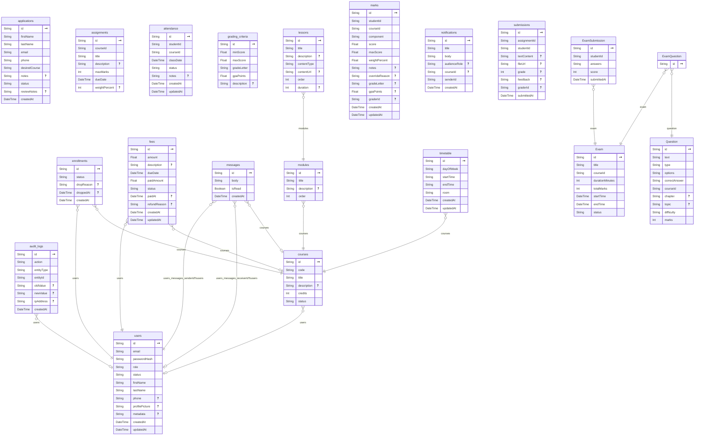

```mermaid
erDiagram

  "applications" {
    String id "🗝️"
    String firstName 
    String lastName 
    String email 
    String phone 
    String desiredCourse 
    String notes "❓"
    String status 
    String reviewNotes "❓"
    DateTime createdAt 
    }
  

  "assignments" {
    String id "🗝️"
    String courseId 
    String title 
    String description "❓"
    Int maxMarks 
    DateTime dueDate 
    Int weightPercent "❓"
    }
  

  "attendance" {
    String id "🗝️"
    String studentId 
    String courseId 
    DateTime classDate 
    String status 
    String notes "❓"
    DateTime createdAt 
    DateTime updatedAt 
    }
  

  "audit_logs" {
    String id "🗝️"
    String action 
    String entityType 
    String entityId 
    String oldValue "❓"
    String newValue "❓"
    String ipAddress "❓"
    DateTime createdAt 
    }
  

  "courses" {
    String id "🗝️"
    String code 
    String title 
    String description "❓"
    Int credits 
    String status 
    }
  

  "enrollments" {
    String id "🗝️"
    String status 
    String dropReason "❓"
    DateTime droppedAt "❓"
    DateTime createdAt 
    }
  

  "fees" {
    String id "🗝️"
    Float amount 
    String description "❓"
    DateTime dueDate 
    Float paidAmount 
    String status 
    DateTime paidAt "❓"
    String refundReason "❓"
    DateTime createdAt 
    DateTime updatedAt 
    }
  

  "grading_criteria" {
    String id "🗝️"
    Float minScore 
    Float maxScore 
    String gradeLetter 
    Float gpaPoints 
    String description "❓"
    }
  

  "lessons" {
    String id "🗝️"
    String title 
    String description "❓"
    String contentType 
    String contentUrl "❓"
    Int order 
    Int duration "❓"
    }
  

  "marks" {
    String id "🗝️"
    String studentId 
    String courseId 
    String component 
    Float score 
    Float maxScore 
    Float weightPercent 
    String notes "❓"
    String overrideReason "❓"
    String gradeLetter "❓"
    Float gpaPoints "❓"
    String graderId "❓"
    DateTime createdAt 
    DateTime updatedAt 
    }
  

  "messages" {
    String id "🗝️"
    String body 
    Boolean isRead 
    DateTime createdAt 
    }
  

  "modules" {
    String id "🗝️"
    String title 
    String description "❓"
    Int order 
    }
  

  "notifications" {
    String id "🗝️"
    String title 
    String body 
    String audienceRole "❓"
    String courseId "❓"
    String senderId 
    DateTime createdAt 
    }
  

  "submissions" {
    String id "🗝️"
    String assignmentId 
    String studentId 
    String textContent "❓"
    String fileUrl "❓"
    Int grade "❓"
    String feedback "❓"
    String graderId "❓"
    DateTime submittedAt 
    }
  

  "timetable" {
    String id "🗝️"
    String dayOfWeek 
    String startTime 
    String endTime 
    String room 
    DateTime createdAt 
    DateTime updatedAt 
    }
  

  "users" {
    String id "🗝️"
    String email 
    String passwordHash 
    String role 
    String status 
    String firstName 
    String lastName 
    String phone "❓"
    String profilePicture "❓"
    String metadata "❓"
    DateTime createdAt 
    DateTime updatedAt 
    }
  

  "Question" {
    String id "🗝️"
    String text 
    String type 
    String options 
    String correctAnswer 
    String courseId 
    String chapter "❓"
    String topic "❓"
    String difficulty 
    Int marks 
    }
  

  "Exam" {
    String id "🗝️"
    String title 
    String courseId 
    Int durationMinutes 
    Int totalMarks 
    DateTime startTime 
    DateTime endTime 
    String status 
    }
  

  "ExamQuestion" {
    String id "🗝️"
    }
  

  "ExamSubmission" {
    String id "🗝️"
    String studentId 
    String answers 
    Int score 
    DateTime submittedAt 
    }
  
    "audit_logs" }o--|o "users" : "users"
    "courses" }o--|o "users" : "users"
    "enrollments" }o--|| "courses" : "courses"
    "enrollments" }o--|| "users" : "users"
    "fees" }o--|o "courses" : "courses"
    "fees" }o--|| "users" : "users"
    "lessons" }o--|| "modules" : "modules"
    "messages" }o--|o "courses" : "courses"
    "messages" }o--|o "users" : "users_messages_receiverIdTousers"
    "messages" }o--|| "users" : "users_messages_senderIdTousers"
    "modules" }o--|| "courses" : "courses"
    "timetable" }o--|| "courses" : "courses"
    "ExamQuestion" }o--|| "Question" : "question"
    "ExamQuestion" }o--|| "Exam" : "exam"
    "ExamSubmission" }o--|| "Exam" : "exam"
```
